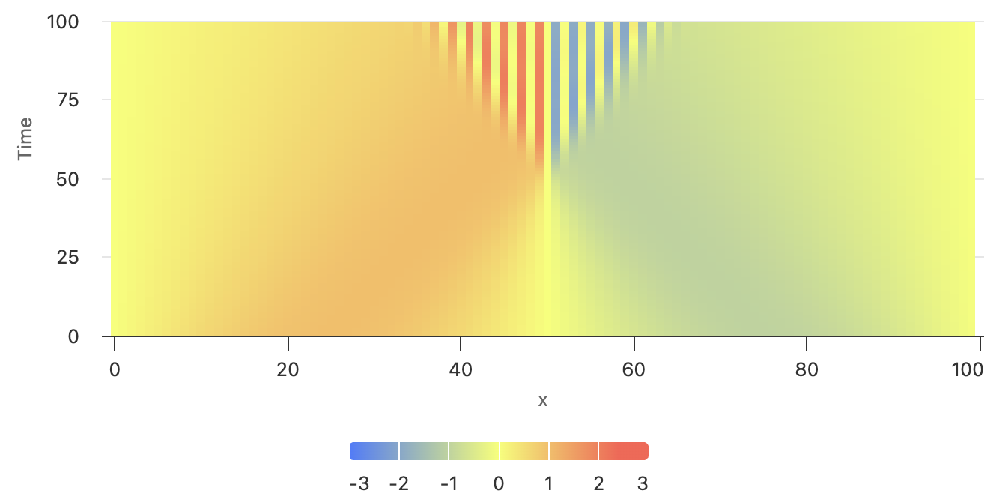
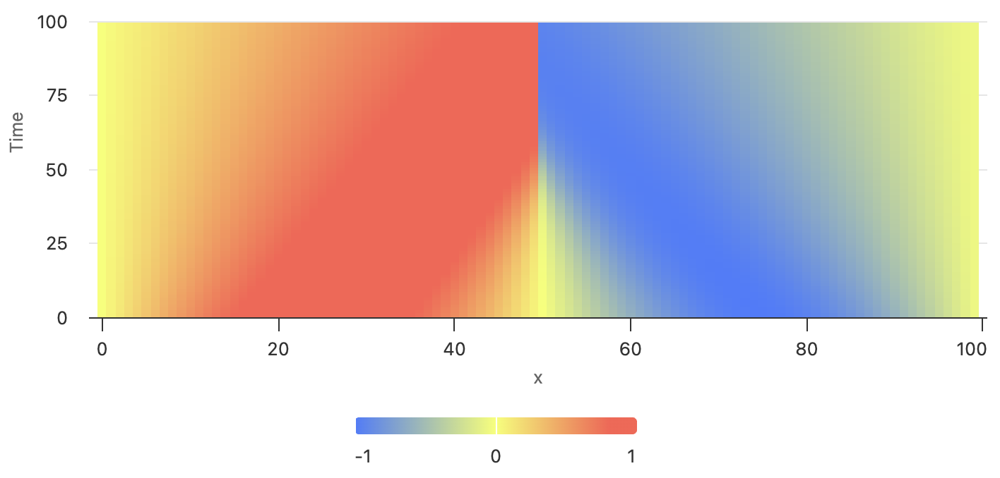
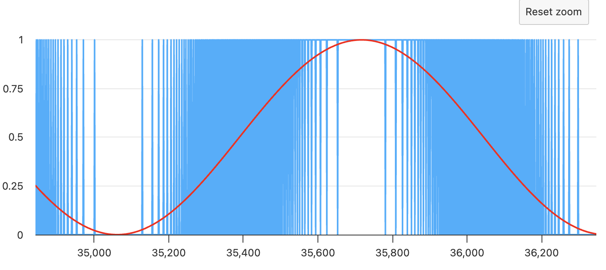
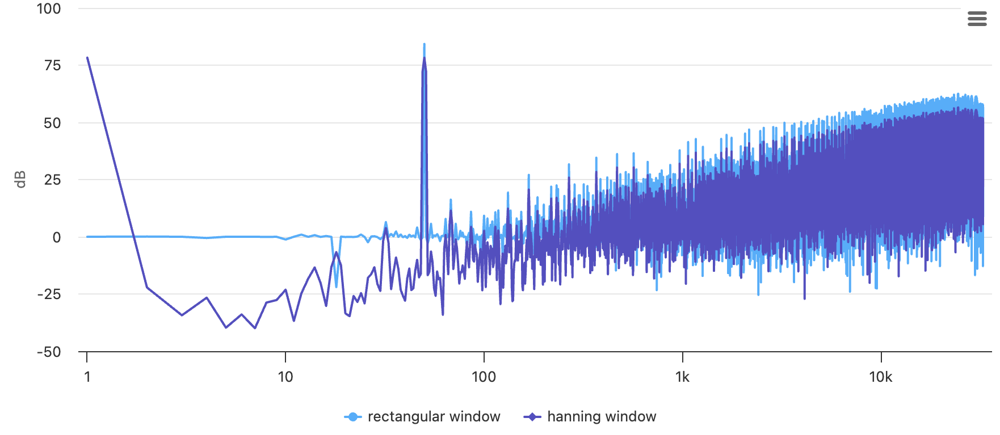
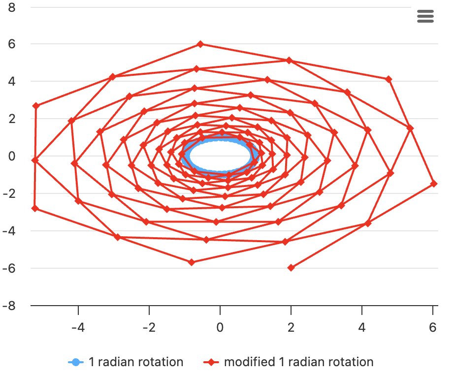

# JATLAB
JATLAB: Use your browser as Scientific Calculator [jatlab.github.io](http://jatlab.github.io/)

## Motivation
Lots of people with Engineering background like myself have used MATLAB for many years, not just for official projects, but also frequently as a quick calculator. 

Unfortunately, with each new version, MATLAB has become more and more bloated with rarely used buttons and features, resulting in longer and longer load times, sluggish performance with heavy memory/CPU usage. Also, the MATLAB license has become more expensive and restrictive, and as a result it is not as widely available as before. 

Finding myself having have to use much lessor alternatives like the Windows' calculator program, an idea came to me.

## Features
With JATLAB, from modern Desktop web browsers (Chrome,Edge,etc) load [jatlab.github.io](http://jatlab.github.io/) then **press F12 key** to open Developer Console to instantly do over ~95% of things you used to do in MATLAB: 

- All Javascript math functions available in Math.* can be used *without* typing `Math.` in front, such as:
	- `sin`,`cos`,`tan`,`exp`,`log10`,`log`,`sqrt`,...
	- Most of these functions are extended to *accept 1D or 2D array as input* and returns 1D or 2D array
- Most commonly used MATLAB features are availble:
	- Plotting: `plot`,`figure`,`close`,`holdon`,`holdoff`,`legend`,`xlabel`,`ylabel`,`gridon`,`gridoff`,`axis`,`title`,`semilogx`,`semilogy`,`loglog`
	- Some 3D Plotting: `contour`,`heatmap`
	- Saving and loading CSV files: `csvread`,`csvwrite`
	- FFT: `fft`,`hanning`
	- Many MATLAB statistic functions such as `rms`,`mean`,`abs`, `sum`, `max`, `min`. They support 1D array of real or complex (2 element array) numbers. 	
	- Complex numbers: `abs`,`angle`,`real`,`imag`. Complex numbers are in the 2-element array *[real_part, imag_part]*. 
	- `rand`,`randn`,`linspace`,`logspace`,`ode23`

MATLAB is vast, but I hope over time people will contribute their expertise to this project to expand these features. 

## Examples

### Basic Plotting
```js
x=linspace(0,2*PI); plot(x,sin(x));
holdon(); plot(x,cos(x),'red');
legend('sin','cos');
```
[](http://jatlab.github.io/)

### 3D Plotting of Time Marched Burger's Equation dy/dt = -y*dy/dx
```js
function dwdt(t,y){
	let n=y.length; let dx=1/n; 
	return y.map( (yu,i)=>-yu*(y[(i+1)%n]-y[i])/2/dx );
}

let tspan = linspace(0,0.32,100); 
let y0=sin(linspace(0,2*PI,100));
let y=ode23(dwdt, tspan, y0);
heatmap(y);
xlabel('x'); ylabel('Time');
```
[](http://jatlab.github.io/)


### Saving and Loading CSV Files
```js
csvwrite(y,'burger.csv');
```
[](http://jatlab.github.io/)
Later
```js
let yt = await csvread();
figure(2);
heatmap(log(add(yt,1.1)))
xlabel('x'); ylabel('Time'); zlabel('log(y+1.1)');
```
This produces the same plot except in log scale. 
[](http://jatlab.github.io/)

Note that due to security Javascript is not allowed to read programmatically generated file name, the user needs to manually select the CSV file using File chooser.

### Integral Form of Burger's equation d($\Delta$ $\overline{y(c)}$)/dt = 0.5 $\times$ ($y^2$(c-$\Delta$/2)-$y^2$(c+$\Delta$/2))
```js
function dwdt(t,y){
	let n=y.length; let dx=1/n; 
	
	return y.map( (yu,i)=>{
		let left=sample1D_cell_centered(y,i-0.5,0);
		let current=sample1D_cell_centered(y,i+0.5,0);
		let right=sample1D_cell_centered(y,i+1.5,0);
		return (pow( (left+current)/2, 2) - pow( (right+current)/2, 2))*0.5/dx;
	} );
}
let tspan = linspace(0,0.32,100); 
let y0=sin(linspace(0,2*PI,100));
let y=ode23(dwdt, tspan, y0);
heatmap(y);
xlabel('x'); ylabel('Time');
```
[](http://jatlab.github.io/)

### With Upwind Bias
```js
function dwdt(t,y){
	let n=y.length; let dx=1/n; 
	
	return y.map( (yu,i)=>{
		let left=sample1D_cell_centered(y,i-0.5,0);
		let current=sample1D_cell_centered(y,i+0.5,0);
		let right=sample1D_cell_centered(y,i+1.5,0);
		
		if(i<n/2)return( pow(left,2)-pow(current,2) )*0.5/dx;
		else return( pow(current,2)-pow(right,2))*0.5/dx;
	} );
}
let y=ode23(dwdt, tspan, y0);
heatmap(y);
xlabel('x'); ylabel('Time');
```
[](http://jatlab.github.io/)

### FFT Plot of Delta-Sigma Modulator
```js
var accum=0;
function dsm(vin){
	accum= accum+vin;
	if(accum>1+randn()*1e-3){
		accum-=1; return 1;
	}else return 0;
}
let vin = add(0.5,scale(0.5,sin(linspace(0,100*PI,65536))));
let dout = vin.map((vin)=>dsm(vin));
plot(dout); holdon(); plot(vin,'red');
```
[](http://jatlab.github.io/)

```js
figure(2);
semilogx(scale(20,log10(abs(fft(dout)))));
holdon();
semilogx(scale(20,log10(abs(fft(scale(hanning(dout.length),dout))))));
ylabel('dB')
legend('rectangular window','hanning window')
```

[](http://jatlab.github.io/)

### Transformation by Matrix
```js
r1=[[cos(1),sin(1)],[-sin(1),cos(1)]];
v0=[0,1];
trail=[];
for(let i=0;i<100;i++){trail.push(v0=mapply(r1,v0));}
trail=transpose(trail);
plot(trail[0],trail[1]); holdon();

r1=[[cos(1),sin(1)],[-sin(1),cos(1)+0.07]];
v0=[0,1];
trail=[];
for(let i=0;i<100;i++){trail.push(v0=mapply(r1,v0));}
trail=transpose(trail);
plot(trail[0],trail[1],'red')
```
[](http://jatlab.github.io/)


## Limitations and Differences from MATLAB

### Basic Arithmetic of Arrays
Unfortunately Javascript does not allow elementwise "+" or "*" for vector/arrays like MATLAB. So for arrays, do the following instead:
```js
a=[1,2,3]; b=[5,5,5]; 
scale(a,2)    // [2, 4, 6]
add(a,b)	  // [6, 7, 8]
scale(a,b)	  // [5, 10, 15]
dot(a,b)	  // 30
```

### Matrix
Javascript does not have matrix either, so "array of array" like below is used to represent matrix:
```js
M=[ 
  [u11,u12,u13,...], 
  [u21,u22,u23,...],
  [u31,u32,u33,...],
  ...
]
M[1][0]  //u21, note array indice starts from 0 in Javascript
```
Use `transpose(M)`,`mcat(M1,M2)`,`mapply(M,[x,y,z,...])` for transposition, matrix multiplication (concatination of transform), multiplication with a vector (1D array), respectively.
 All math functions are expanded to support both arrays and matrices elementwise, except:
- For `abs`, if given a matrix, it will find vector length of each sub vectors and returns an array of lengths, for example:
	```js
	abs([[3,4],[1,-1]])   // [5, sqrt(2)]
	``` 
- For `sum` if given matrix will return an array of sums, for example
	```js
	sum([[1,2,3],[10,10,10],[5,5,5]])   // [16, 17, 18]
	``` 
- For `mean` and `rms`, if given a matrix, will treat all elements in the matrix as a single array and return a single scalar representing the mean or rms of every element.
- `dot` only supports two 1D-array as input

A 2D array / matrix can be given directly to 3D plot functions `heatmap` or `contour`. 

Use `map` or `reduce`:
```js
A=[[c,s],
   [-s,c]];
b=[x,y];
A.map(v=>dot(v,b));     // Multiply vector (x,y) with matrix A. Equivalent to mapply(A,b)
[M1,M2,M3,...].reduce((p,m)=>p+sum(m),0);  // returns sum of all elements of an array of matrices
```


### Javascript Ways of Manipulating Array
Javascript uses in my opinion less cryptic syntax to manipulate arrays:
```js
a=[1,2,3,4,5];
a.slice(2,4)		// [3,4], in MATLAB a(3:4)
a.push(6)			// [1,2,3,4,5,6], in MATLAB a(end+1)=6
a.unshift(0)		// [0,1,2,3,4,5,6], in MATLAB a=[0,a];
u=a.pop()			// u=6, a=[0,1,2,3,4,5], in MATLAB u=a(1); a=a(2:end)
w=a.shift()			// w=0, a=[1,2,3,4,5],  in MATLAB w=a(end);a=a(1:end-1)
```
